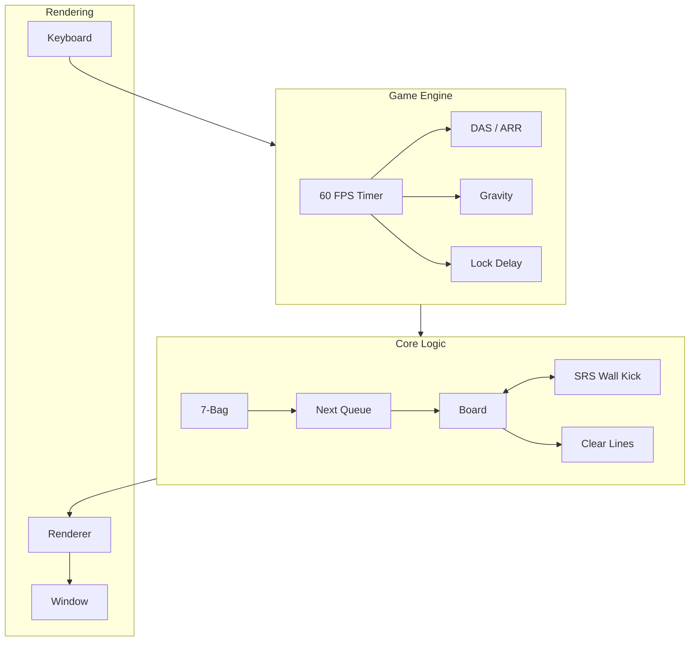
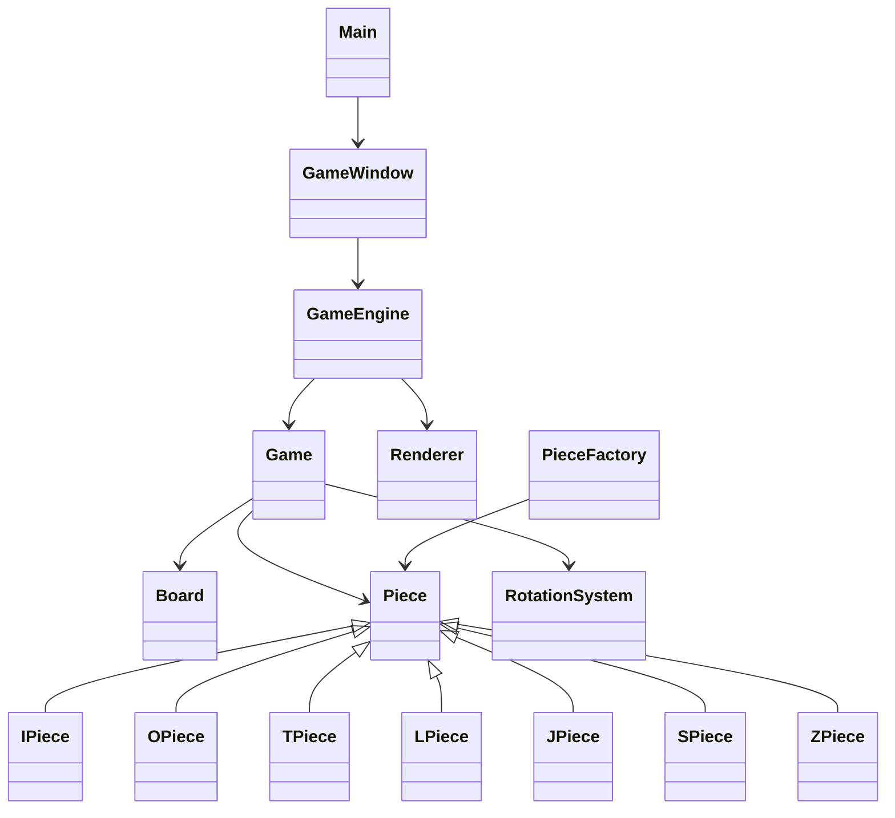

<div align="center"> 
# 🧱 TETRIS FROM ZERO: THE MODERN WAY


### Xây dựng Game Tetris chuẩn thi đấu quốc tế (Guideline) từ con số 0 với Java Swing

Dự án này là một bộ khung hoàn chỉnh giúp hiểu rõ các thuật toán nâng cao như **SRS (Super Rotation System), 7-Bag Randomizer, DAS/ARR**, **Lock Delay**, **Ghost Piece**, và cách tổ chức **Game Loop** theo kiến trúc chuyên nghiệp mà không sử dụng bất kỳ game engine nào.

Mục tiêu của dự án không chỉ là tạo ra một game Tetris có thể chơi được, mà còn giúp người học hiểu sâu về:

* Thiết kế phần mềm hướng đối tượng (OOP)
* Separation of Concerns
* Kiến trúc Game Engine
* Xử lý Input thời gian thực
* Thuật toán xoay khối hiện đại (SRS)
* Cơ chế Randomizer chuẩn Tetris Guideline
  
<p align="center">  </p>

---

# 📚 Navigation

* [🌟 Tổng quan](#-tổng-quan)
* [🏗️ Kiến trúc hệ thống](#️-kiến-trúc-hệ-thống)
* [📁 Tổ chức project](#-tổ-chức-project)
* [🧠 Giải thích các module](#-giải-thích-các-module)
* [🔗 Quan hệ giữa các lớp](#-quan-hệ-giữa-các-lớp)
* [⚙️ Luồng hoạt động của game](#️-luồng-hoạt-động-của-game)
* [🧠 Giải ngố: Các cơ chế hoạt động](#-giải-ngố-các-cơ-chế-hoạt-động)
* [🚀 Bắt đầu nhanh](#-bắt-đầu-nhanh-step-by-step)
* [🎮 Hướng dẫn điều khiển](#-hướng-dẫn-điều-khiển-pro-controls)
* [🧩 Các thuật toán hiện đại](#-các-thuật-toán-hiện-đại)
* [🛠️ Debug & lỗi thường gặp](#️-debug--lỗi-thường-gặp)
* [🗺️ Roadmap](#️-roadmap)
* [🤝 Đóng góp](#-đóng-góp)
* [📄 License](#-license)

---

# 🌟 Tổng quan

Một tựa game Tetris cơ bản chỉ là một ma trận 2D và các khối rơi xuống.

Tuy nhiên, để đạt chuẩn **Modern Tetris Guideline**, trò chơi cần rất nhiều cơ chế phía sau:

* SRS Wall Kick
* Hold Piece
* Ghost Piece
* Next Queue
* 7-Bag Randomizer
* DAS / ARR
* Lock Delay
* Combo
* Back-to-Back
* T-Spin

Project này chia tách hoàn toàn giữa:

* **Core Logic** → xử lý toán học và trạng thái game
* **Rendering Engine** → hiển thị đồ họa
* **Input System** → xử lý bàn phím
* **Game Engine** → điều phối toàn bộ trò chơi

Nhờ đó code dễ mở rộng, dễ debug và dễ bảo trì.

---

# 🏗️ Kiến trúc hệ thống

Project tuân thủ nghiêm ngặt nguyên lý:

> Separation of Concerns (SoC)

Mỗi lớp chỉ đảm nhiệm một trách nhiệm duy nhất.



---

# 📁 Tổ chức project

```text
Modern-Tetris-Java/
│
├── Main.java
├── GameEngine.java
├── Game.java
├── Board.java
│
├── Piece.java
├── IPiece.java
├── OPiece.java
├── TPiece.java
├── LPiece.java
├── JPiece.java
├── SPiece.java
├── ZPiece.java
│
├── PieceFactory.java
├── PieceType.java
├── RotationSystem.java
│
├── GameWindow.java
└── Renderer.java
```

---

# 🧠 Giải thích các module

## Main.java

Điểm khởi chạy của ứng dụng.

Nhiệm vụ:

* Khởi tạo cửa sổ game
* Khởi tạo Engine
* Bắt đầu vòng lặp game

```java
public static void main(String[] args) {
    SwingUtilities.invokeLater(GameWindow::new);
}
```

---

## GameEngine.java

Là bộ điều phối trung tâm.

Quản lý:

* Game Loop
* FPS
* Gravity
* DAS
* ARR
* Lock Delay
* Input State

Không trực tiếp xử lý logic bàn cờ.

Vai trò chính:

```text
Input
 ↓
Engine
 ↓
Game
 ↓
Renderer
```

---

## Game.java

Lưu toàn bộ trạng thái của trận đấu.

Quản lý:

* Piece hiện tại
* Hold Piece
* Next Queue
* Spawn Piece
* Game Over
* Scoring

Đây là lớp được gọi nhiều nhất trong toàn bộ game.

---

## Board.java

Đại diện cho Arena.

```text
23 hàng × 10 cột
```

Chứa:

```java
private int[][] grid;
```

Các chức năng:

* Kiểm tra va chạm
* Đặt khối
* Xóa hàng
* Kiểm tra Game Over

---

## Piece.java

Lớp cha của toàn bộ khối Tetris.

Lưu:

* Shape Matrix
* Position
* Rotation State

Ví dụ:

```java
int[][] shape;
int row;
int col;
int rotation;
```

---

## IPiece, OPiece, TPiece,...

Các lớp con chỉ định nghĩa:

```java
shape
```

ban đầu của từng khối.

Ví dụ:

```java
0 0 0 0
1 1 1 1
0 0 0 0
0 0 0 0
```

---

## PieceFactory.java

Triển khai Factory Pattern.

Thay vì:

```java
new TPiece();
```

ta dùng:

```java
PieceFactory.create(PieceType.T);
```

Giúp giảm phụ thuộc giữa các lớp.

---

## PieceType.java

Enum mô tả 7 loại khối.

```java
I, O, T, S, Z, J, L
```

Được dùng trong:

* Queue
* Factory
* 7-Bag

---

## RotationSystem.java

Là nơi chứa toàn bộ dữ liệu SRS.

Bao gồm:

* Kick table J/L/S/T/Z
* Kick table I
* Thuật toán thử offset

Đây là module phức tạp nhất của game.

---

## GameWindow.java

Lớp giao tiếp với Swing.

Quản lý:

* JFrame
* JPanel
* KeyAdapter
* Focus

Không chứa logic game.

---

## Renderer.java

Chịu trách nhiệm hiển thị.

Vẽ:

* Board
* Piece
* Ghost Piece
* Hold
* Queue
* UI

Renderer tuyệt đối không thay đổi trạng thái game.

---

# 🔗 Quan hệ giữa các lớp



---

# ⚙️ Luồng hoạt động của game

Mỗi frame:

```text
Timer Tick
     │
     ▼
Đọc Input
     │
     ▼
DAS / ARR
     │
     ▼
Gravity
     │
     ▼
Rotate (SRS)
     │
     ▼
Collision Check
     │
     ▼
Lock Delay
     │
     ▼
Freeze Piece
     │
     ▼
Clear Lines
     │
     ▼
Spawn Piece
     │
     ▼
Render
```

Tất cả diễn ra khoảng:

```text
60 lần / giây
```

---

# 🧠 Giải ngố: Các cơ chế hoạt động

## Xoay ma trận bằng toán học

Thay vì hard-code 4 trạng thái xoay khác nhau.

Ta xoay trực tiếp ma trận:

```text
Transpose
↓
Reverse
```

Ví dụ:

```text
1 0
1 1
```

sẽ trở thành:

```text
1 1
1 0
```

---

## Xóa hàng siêu tốc

Khi hàng thứ i đầy:

```java
for (int r = i; r > 0; r--) {
    grid[r] = grid[r - 1];
}
```

Sau đó:

```java
i++;
```

để quét lại hàng vừa tụt xuống.

---

## Chống dội phím

Hệ điều hành tự động spam:

```text
keyPressed
keyPressed
keyPressed
...
```

Giải pháp:

```java
spaceHeld
```

Chỉ cho phép hard drop một lần cho tới khi:

```java
keyReleased
```

được gọi.

---

# 🚀 Bắt đầu nhanh (Step-by-step)

## 1. Clone project

```bash
git clone https://github.com/your-username/Modern-Tetris-Java.git
cd Modern-Tetris-Java
```

## 2. Compile

```bash
javac *.java
```

## 3. Run

```bash
java Main
```

---

# 🎮 Hướng dẫn điều khiển (Pro Controls)

| Phím      | Chức năng  | Mô tả               |
| --------- | ---------- | ------------------- |
| ← / →     | Move       | Di chuyển trái phải |
| ↓         | Soft Drop  | Rơi nhanh           |
| Space     | Hard Drop  | Rơi tức thì         |
| X / ↑     | Rotate CW  | Xoay phải           |
| Z         | Rotate CCW | Xoay trái           |
| Shift / C | Hold       | Giữ khối            |
| R         | Restart    | Khởi động lại       |

---

# 🧩 Các thuật toán hiện đại

## SRS Wall Kick

Nếu xoay thất bại:

```text
(0,0)
(-1,0)
(-1,1)
(0,-2)
(-1,-2)
```

Game thử từng offset theo thứ tự.

---

## 7-Bag Randomizer

Thay vì:

```text
Random Random Random...
```

Game tạo:

```text
[I O T S Z J L]
```

sau đó xáo trộn.

Điều này đảm bảo:

* Không bị drought quá lâu
* Phân phối cân bằng

---

## DAS / ARR

Ví dụ:

```text
DAS = 167ms
ARR = 33ms
```

Khi giữ phím:

```text
←
|
167ms
|
← ← ← ← ←
```

Khối sẽ tự động trượt liên tục.

---

## Lock Delay

Khi Piece chạm đất:

```text
500ms
```

người chơi vẫn có thể:

* xoay
* di chuyển
* finesse

trước khi Piece bị khóa.

---

# 🛠️ Debug & lỗi thường gặp

## offsets == null

```text
NullPointerException
```

Nguyên nhân:

```java
updateOffsets();
```

chưa được gọi trong constructor.

---

## Không xoay được sát tường

Kiểm tra:

* RotationSystem
* Kick Table
* Rotation State

---

## Hard Drop bị spam

Sử dụng:

```java
spaceHeld
```

và reset trong:

```java
keyReleased()
```

---

## FPS không ổn định

Không sử dụng:

```java
while(true)
```

trong EDT.

Nên dùng:

```java
new Timer(16, e -> update());
```

---

# 🗺️ Roadmap

## Phase 1

* [x] Board
* [x] Piece
* [x] Gravity

## Phase 2

* [x] SRS
* [x] Hold
* [x] Queue
* [x] Ghost Piece

## Phase 3

* [ ] Scoring System
* [ ] Combo
* [ ] Back-to-Back
* [ ] T-Spin Detection

## Phase 4

* [ ] Replay System
* [ ] AI Bot
* [ ] Multiplayer
* [ ] Garbage System

---

# 🤝 Đóng góp

Nếu muốn cải thiện dự án:

1. Fork repository
2. Tạo branch mới
3. Commit thay đổi
4. Push branch
5. Tạo Pull Request

---

# 📄 License

MIT License.

Bạn được phép:

* Học tập
* Chỉnh sửa
* Mở rộng
* Sử dụng cho mục đích giáo dục

Nếu project giúp ích cho bạn, hãy cân nhắc ⭐ repository để ủng hộ tác giả.
