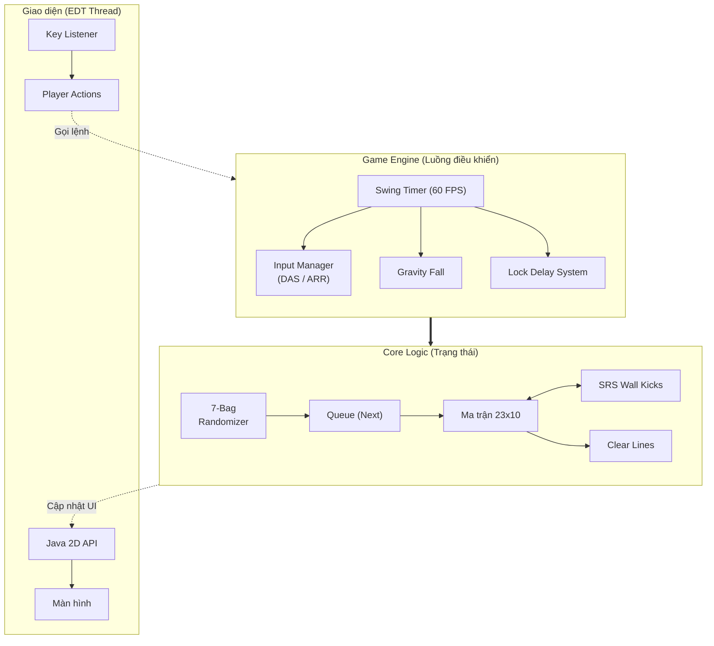

<div align="center">


# 🧱 TETRIS FROM ZERO: THE MODERN WAY

### Xây dựng Game Tetris chuẩn thi đấu quốc tế (Guideline) từ con số 0 với Java Swing

Dự án này là một bộ khung hoàn chỉnh giúp hiểu rõ các thuật toán nâng cao như **SRS (Super Rotation System), 7-Bag Randomizer, DAS/ARR** và quản lý **Game Loop** mà không dùng bất kỳ game engine nào.

[](https://www.oracle.com/java/)
[]()
[]()

</div>

---

## 🌟 Tổng quan

Một tựa game Tetris cơ bản chỉ là một ma trận 2D và các khối rơi xuống. Nhưng để game đạt chuẩn **Modern Tetris**, nó cần một hệ thống logic đồ sộ phía sau. Project này chia tách rõ ràng giữa **Core Logic (Xử lý toán học)** và **Render Engine (Vẽ đồ họa)**.

## 🏗️ Kiến trúc hệ thống

Project tuân thủ chặt chẽ nguyên lý **Separation of Concerns**. Luồng đi của dữ liệu được mô tả như sau:



## 🧠 Giải ngố: Các cơ chế hoạt động ra sao?

* **Xoay ma trận bằng Toán học:** Thay vì hard-code 4 hình dạng, dùng thuật toán xoay ma trận vuông 90 độ. (Ví dụ Xoay CW: Lấy ma trận chuyển vị sau đó đảo ngược thứ tự các cột).

* **Xóa hàng siêu tốc:** Khi phát hiện hàng `i` đầy, dùng vòng lặp kéo toàn bộ các hàng phía trên tụt xuống 1 bậc. Quan trọng nhất là tăng `i++` để vòng lặp kế tiếp quét lại chính hàng vừa tụt xuống.

* **Chống lỗi Dội phím (Key Repeat):** Hệ điều hành spam sự kiện `KeyPressed` liên tục khi đè phím. Khắc phục bằng cờ (Flags) `spaceHeld = true` và chỉ mở khóa khi `keyReleased` kích hoạt.

## 🚀 Bắt đầu nhanh (Step-by-step)

1. Clone project về máy:

```bash
git clone https://github.com/your-username/Modern-Tetris-Java.git
cd Modern-Tetris-Java
```

2. Biên dịch (Compile):

```bash
javac *.java
```

3. Chạy Game (Run):

```bash
java Main
```

## 🎮 Hướng dẫn điều khiển (Pro Controls)

| **Phím tắt**  | **Tính năng**   | **Giải thích**                           |
| ------------- | --------------- | ---------------------------------------- |
| `←` / `→`   | Di chuyển       | Đè lâu để kích hoạt DAS trượt siêu nhanh |
| `↓`          | Soft Drop       | Rơi nhanh để căn góc                     |
| `Space`       | **Hard Drop**   | Đập mạnh khối xuống đáy lập tức          |
| `↑` / `X`    | Xoay phải (CW)  | Xoay thuận chiều kim đồng hồ             |
| `Z`           | Xoay trái (CCW) | Xoay ngược chiều kim đồng hồ             |
| `C` / `Shift` | Hold Piece      | Cất khối hiện tại vào kho để dùng sau    |
| `R`           | Restart         | Chơi lại ngay lập tức khi Game Over      |

## 🛠️ Xử lý lỗi thường gặp

| **Báo lỗi ở Console**                          | **Cách Khắc Phục**                                                                                                        |
| ---------------------------------------------- | ------------------------------------------------------------------------------------------------------------------------- |
| `NullPointerException: "this.offsets" is null` | Quên gọi hàm `updateOffsets();` ở dòng cuối cùng trong Constructor của các class Piece. Thêm vào rồi compile lại.         |
| Cửa sổ đen xì, không phản hồi phím             | Code Logic đang chặn luồng UI (Ví dụ vòng lặp vô hạn ở hardDrop). Kiểm tra lại cờ chống dội phím trong `GameWindow.java`. |
